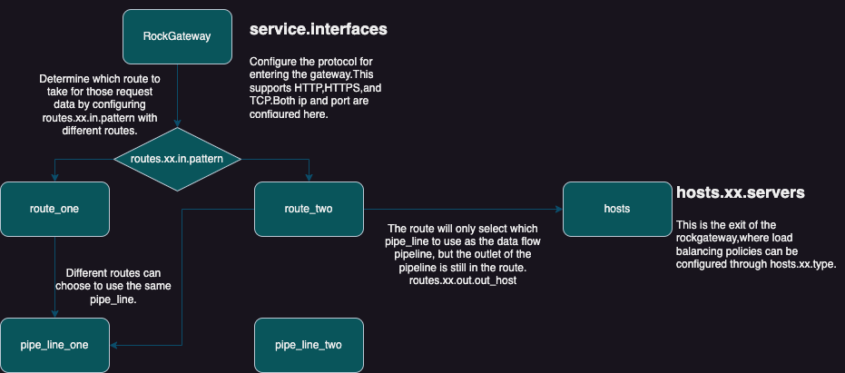

# **RockWaypoint-RWP**

## **Introduction**
RockWaypoint is a high-performance and absolutely open asynchronous gateway.
It can be used as a top-level gateway or an API gateway.
Supports multiple protocols: TCP, HTTP, and HTTPS.
Supports multiple plug-ins, plug-and-play configuration, and the plug-ins can be combined freely and configured randomly.
（Ratelimiter, Circuit breaking, Black and white lists...Caching, etc.）
And a variety of load balancing strategies have been added for the host address.

**In RockWaypoint, there are the concepts of route and pipe_line. Multiple routes can be created in RockWaypoint. Multiple pipe_lines can also be created. There is a many-to-one relationship between route and pipe_line**
****

## Usage

### command line

```bash
USAGE:
    rock_waypoint [OPTIONS]

FLAGS:
    -h, --help       Prints help information
    -V, --version    Prints version information

OPTIONS:
    -c, --config <config>          Config file [default: rock.yaml]
    -l, --log-level <log-level>    Logging level to use [default: info]
```

### source code

```bash
git clone https://github.com/rockjl/rwp.git
cd rwp && cargo build -r
./target/release/rwp -c rock.yaml
```

## Document

online doc: [https://rockjl.github.io/rwp/](https://rockjl.github.io/rwp/)

Local doc: /docs/README.md

## Development

```bash
git clone https://github.com/rockjl/rwp.git
cd rwp && cargo run
```


