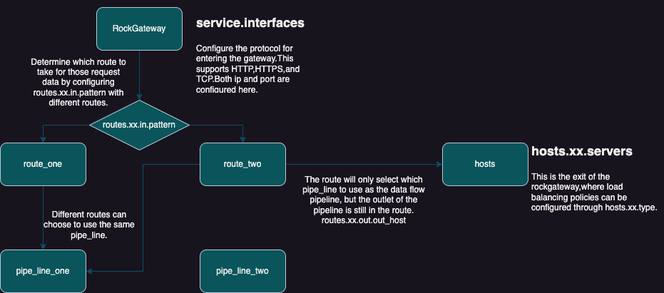
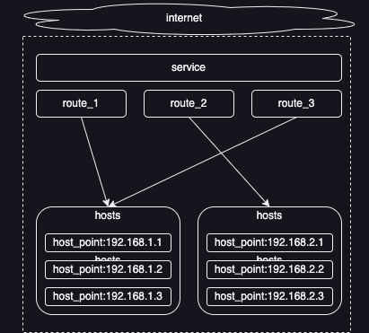

# **RockWaypoint-RWP**

## **介绍**
RockWaypoint是一个高性能且绝对开放式的异步网关。
可做顶层网关，也可做API网关。
支持多种协议，TCP,HTTP,HTTPS。
支持多种插件，可插拔式的配置，插件可以随意组合，且随意拼接配置。
（限流，熔断，黑白名单...缓存等。）
并为主机地址增加了多种负载均衡策略。

**在rockwaypoint中分为route与pipe_line的概念。在rockwaypoint中可以创建多个route。也可以创建多个pipe_line。route与pipe_line是多对一的关系。**
****

- **rockwaypoint的入口配置在service.interfaces中，这里支持http,https,tcp多种协议。**
- **数据进入到rockwaypoint中以后走哪一个route，配置在route.xx.in.pattern中。通过正则表达式，匹配进入的路径，决定了当前请求走哪一个route配置。**
- **route的配置，不但决定了请求的进入，也决定了请求数据的出口在哪里。还决定了使用哪一个pipe_line作为请求数据从入口到出口的管道。**
- **不同的route可以选择同一个pipe_line作为数据流管道**
- **route只会选择哪一个pipe_line作为数据流的管道，但是数据流的出口还是在route中配置。**

### **route 与 pipe**

如果不同的两个route使用了同一个pipe。那么系统会为两个route自动生成两个不同的pipe实例。

## **hosts**

**网络主机host_point配置**

这里可以选择负载均衡，error_handling_plan，host_point的权重等，针对host_poinst的一些具体配置。这里的host_name随便起名，会在pipe_line的配置中选择当前配置。

```bash
hosts:
  httpbin: # host-name 名字随便起
    type: round_robin  # least_connection  random  ip_round_robin
    error: test1
    servers:
      - scanme.nmap.org:80 timeout=5000ms weight=3 max_fails=3 fail_timeout=9s
  httpsbin:
    type: round_robin
    servers:
      - www.baidu.com:443
  tcpbin:
    type: ip_round_robin  # least_connection  random  round_robin
    servers:
      - 110.242.68.247:80 # 110.242.68.247:80
```

### **负载均衡**

**这里设置的转发目标主机有很多种负载均衡方式，round_robin，random，ip_round_robin。**

- round_robin: 会根据每次请求，轮训到每一个目标主机。适用于http,https协议
- random: 会根据每次请求，随机到不同的目标主机，适用于http,https协议
- ip_round_robin: 会根据请求的ip地址，轮训到每一个目标主机，适用于http,https,tcp协议

### **权重**

**权重**

配置在每一个host_point后面，同其他配置用空格分割。如果权重未配置，默认为1。

### **error_handling_plan**

这里可以选择error_handling_plan，填写error_handling_plan名字即可，具体的error_handling_plan配置看[errors](#errors)。

### **熔断配置**

详细的内容可以点击[熔断配置](#circuit-breaker)。

## **routes**

**gateway的所有路由配置都在此处设置。**

```yaml
routes:
  http_test:		# 路由名字
    protocol: http # http,https,tcp 
    priority: 999
    ratelimiter:
      type: route # route,ip
      period: 1s
      burst: 2
    in:
      type: regex
      pattern: "^/w*"
      method: ["GET", "POST"]
    out:
      type: network
      path: "/"
      out_host: httpbin
    pipe: http_pipe
```

### **priority**

**路由的优先级**

如果路由设置过多，优先尝试匹配哪一个，可以设置priority。如果未设置此值，那么当前路由优先级为1。此设置值越大优先级越高。

### ratelimiter

**路由级别限流设置。**

这里分为：route与ip两个模式。整个gateway在运行过程中，不同的route有自己的实例，彼此数据隔离。
type有两种设置:

- route: 当前route在period时间内只允许burst个请求通过。
- ip: 当前route级别不同的remote_ip只允许在period时间内只允许burst个请求通过。

```bash
  ratelimiter:
    type: service # route,ip
    period: 1s    # 多长时间之内
    burst: 100    # 允许多少个请求通过
```

### in

**路由入口配置，也是如何匹配当前路由的配置。**

入口分为三种配置：regex, ip, ipfile。
method是可选项，只有在http或者https协议的时候才会生效。

- regex: 用来根据http请求url路径来匹配路由。支持协议：http, https

  ```yaml
  type: regex
  pattern: "^/w*"  # 正则表达式
  method: ["GET", "POST"] # 可选项，仅在http,https协议生效
  ```

- ip: 用来根据ip范围匹配路由。支持协议：http,https,tcp

  ```yaml
  type: ip
  ranges: 
  	- "127.0.0.1-127.0.0.1"
  	- "192.168.1.0-192.168.1.255"
  method: ["GET", "POST"] # 可选项，仅在http,https协议生效
  ```

- ipfile: 用来根据ip范围匹配路由。支持协议：http,https,tcp

  ```yaml
  type: ipfile
  file: "ip.txt"  # 文件
  method: ["GET", "POST"] # 可选项，仅在http,https协议生效
  ```

### out

**主要用来配置gateway的出口。**

主要有两种配置，一个是转发到网络host主机，另一个是转发到本地文件系统。

host:

```yaml
type: network
path: "/" # 会附加在host_point的IP地址和请求path之间。"/"代表不附加任何路径。此选项仅在http,https协议生效。 
out_host: httpbin # host_name
```

file:
````yaml
type: file
root_path: examples/web_s # web根目录
index_file: index.html    # web的index文件名
````

### pipe

**选择使用哪一个pipe_line。**

填写pipe_name即可。

## errors<a id="errors"></a>

**用来配置error_handling_plan。也就是业务角度的异常处理措施。**

```yaml
errors:
  test1: 
    type: http
    error_list: hsc_404 hsc_500 hsc_504
    pass_next: true
    return: hsc_404
```

- errors: 下面可以写很多error_handling_plan。随便起名字即可。
- type: 目前只支持http协议。
- error_list: 用空格分割，开头为```hsc_```。主要用来表示在http_response中遇到哪一种StatusCode会被认定为error。
- pass_next：当前http_response被认定为error后，是否要把请求传递到下一个host_point。在这里会重新load_balance出来一个新的host_point。
- return: 当无host_point可用，或者pass_next为false的情况下，当前http_response被认定为error，此时需要返回给gateway的请求方哪一种StatusCode。使用```hsc_```开头。

## pipes

**pipe_line配置**

我们在文档中把pipes叫pipe_line，实际上在配置文件中叫做pipes。所有的插件都在pipes里边配置，在rockwaypoint中把插件叫做pipe_module。
例子：

```rust
pipes:              # 每一个pipeline拥有自己独立的memory_cache实例。
  http_pipe:
    - ratelimiter:
        type: service # service,route,pipeline,ip_pipe,ip_route,ip_service
        period: 1s
        burst: 2
    - memory_cache_get:
        hit: 3      #命中次数达到或者超过这个数字，缓存就会自动删除
        expire: 3min  #缓存命中以后，重新设置缓存过期时间
    - header_request:
        add:
          - Rock-Jiang: 'rockjiang'
        del:
          - "abc"
          - "hohoho"
    - dispatche:
    - header_response:
        add:
          - Access-Control-Allow-Origin: '*'
          - Access-Control-Allow-Headers: 'origin, content-type, accept'
          - Access-Control-Allow-Methods: 'GET, POST, PUT, DELETE'
    - memory_cache_set: 
        hit: 0      #初始 命中数量
        expire: 3min # 首次超时时间
                    # (年y,月m,周w,天d,小时h,分min,秒s,毫秒ms,微秒us,纳秒ns,皮秒ps) 
                    # 每周按照7天计算。
                    # 每月按照30天计算。
                    # 每年按照365天计算。
                    # ps允许设置但是除非大于1000,否则会按照0NS计算。多出来的也会抹零。系统最小单位ns
    - return:
  tcp_pipe:
    - dispatche:
```

我们来解读一下上面的pipe_line配置：

> 1. 首先这里给pipe_line起了一个名字叫做http_pipe
> 2. 下面的pipe_module执行顺序是这样的
>    ratelimiter
>    memory_cache_get
>    header_request
>    dispatche
>    header_response
>    memory_cache_set
>    return
> 3. 如果ratelimiter发现达到了限流的阈值。则直接按照当前规则返回。否则向下继续执行。
> 4. 如果memory_cache_get在缓存中查找到了值，则后面的pipe_module都不会进入，直接正常执行return这个pipe_module。如果没有则继续向下执行。
> 5. header_request这个pipe_module用来修改请求之前的request中的header数据，相同的key就覆盖，不同的key就添加。也可以删除某一个key。
> 6. dispatche这个pipe_module的作用是转发组织好的request数据到hosts指定的地址。
> 7. header_response这个pipe_module的作用是修改response中的header数据。有的人可能觉得这个pipe_module没有任何作用。但像是本例中为每一个response中的header添加浏览器跨域功能就是一个使用场景。
> 8. 在这里return也是一个pipe_module。他的作用是组织已经成型的返回数据，形成一个可以返回的response。这个返回数据有可能是通过dispatche从hosts拿到的，也有可能是从cache中拿到的。这都无所谓。但是return的目的只有一个，就是组织数据，一个可以直接返回的数据。

## pipe_module

### upgrade_insecure_requests

**http升级https**

一个特殊的pipe_module。
支持协议：http
当系统设置全局配置：disable_upgrade_insecure_requests为false的时候，会在http协议数据进入的时候执行。

### cache

**缓存**

#### memory_cache_set

本地缓存pipe_module。用于存储缓存。包含两个参数hit,expire。
支持协议：http,  https
hit: 
    初始化命中次数，如果未设置或者设置成-1。则不启用命中计数。
    这仅仅只是一个初始值。但是如果memory_cache_get中未设置hit值，那么每次从缓存中获取的时候也不会判断。
expire: 
    初始化key过期时间，如果未设置。则为默认为永久不过期。

#### memory_cache_get
本地缓存pipe_module。用于获取缓存。包含两个参数hit,expire。
支持协议：http,  https
hit: 
    最大缓存命中次数，如果未设置或者设置成-1，则不做用缓存命中计数的计算。
    如果memory_cache_set.hit中未设置初始值，则这里会设置初始值为1。代表已经命中一次。
expire: 
    缓存命中后刷新缓存的过期时间，如果未设置或设置为0，则使用旧的缓存过期时间(也就是memory_cache_set.expire
back:
    缓存命中后是否立即返回。默认false。
时候设置的缓存过期时间，如果没有设置则无)。如果设置了则根据此值刷新缓存过期时间。

#### redis_cache_set
redis缓存pipe_module。用于存储缓存。包含两个参数hit,expire。
支持协议：http,  https
hit: 
    初始化命中次数，如果未设置或者设置成-1。则不启用命中计数。初始化的时候，不会存入命中数据到缓存中。
    这仅仅只是一个初始值。但是如果redis_cache_get中未设置hit值，那么每次从缓存中获取的时候也不会判断。
expire: 
    初始化key过期时间，如果未设置。则为默认为永久不过期。

#### redis_cache_get
redis缓存pipe_module。用户获取缓存。包含两个参数hit,expire。
支持协议：http,  https
hit: 
    最大缓存命中次数，如果未设置或者设置成-1，则不做用缓存命中计数的计算。
    如果redis_cache_set.hit中未设置初始值，则这里会设置初始值为1。代表已经命中一次。
expire: 
    缓存命中后刷新缓存的过期时间，如果未设置或设置为0，则使用旧的缓存过期时间(也就是redis_cache_set.expire时候
back:
    缓存命中后是否立即返回。默认false。
设置的缓存过期时间，如果没有设置则无)。如果设置了则根据此值刷新缓存过期时间。

### header_request

**http的header_request修改器**

支持协议：http,  https

- add: 是一个键值对。实际上就是header的增加。
- del: 只是一个字符串，填写header的key即可。通过key删除。

这里的add值时一个append操作，如果出现相同的key，或者headers中本来就有相同的key，会执行append操作，而不是add操作。所以出现相同的key，后面key的value不会覆盖前面的key的value。所以如果不想要原有的，需要在del中添加相应的key。因为header_response会优先执行del然后才会执行add。 

```yaml
add:
	- Connection: keep-alive
	- Access-Control-Allow-Origin: '*'
	- Access-Control-Allow-Headers: 'origin, content-type, accept'
	- Access-Control-Allow-Methods: 'GET, POST, PUT, DELETE'
```


### header_response

**http的header_response修改器**

支持协议：http, https

- add: 是一个键值对。实际上就是header的增加。
- del: 只是一个字符串，填写header的key即可。通过key删除。

这里的add值时一个append操作，如果出现相同的key，或者headers中本来就有相同的key，会执行append操作，而不是add操作。所以出现相同的key，后面key的value不会覆盖前面的key的value。所以如果不想要原有的，需要在del中添加相应的key。因为header_response会优先执行del然后才会执行add。 

```yaml
header_request:
	add:
		- RWP: 'rockwaypoint'
	del:
		- "abc"
 		- "hohoho"
```


### dispatche

**转发**

真正执行转发的pipe_module。在这里会执行route.xx.out中指定的目的地。
支持协议：http, https, tcp

#### dispatch_network

这个pipe_module属于dispatche的子pipe_module。不可以直接配置在pipe_line中。在dispatch内部自动选择之行。
<font color=red>注意：如果当前pipe_line的执行过程中，缓存已经命中。则当前pipe_module则不执行</font>

#### dispatch_file

这个pipe_module属于dispatche的子pipe_module。不可以直接配置在pipe_line中。在dispatch内部自动选择之行。
<font color=red>注意：如果当前pipe_line的执行过程中，缓存已经命中。则当前pipe_module则不执行</font>

#### dispatch_tcp

这个pipe_module属于dispatche的子pipe_module。不可以直接配置在pipe_line中。在dispatch内部自动选择之行。
<font color=red>注意：如果当前pipe_line的执行过程中，缓存已经命中。则当前pipe_module则不执行</font>

### black_white_list

**黑白名单**

支持协议：http, https, tcp

> 配置规则：
>
> 1. 优先匹配memory，如果memory存在则不考虑file配置。如果两个都配置了，则file配置会被无视。
> 2. 优先检查白名单(white_list)，然后检查黑名单(black_list)。
> 3. 如果配置了白名单，则当前pipe_line的数据通过，必须严格按照白名单。如果ip未在白名单，则不可以通过。
> 4. 如果配置了黑名单，则ip在黑名单内，则不可以通过。
> 5. 黑白名单可以配置单一ip，也可以配置ip范围。
> 6. 配置0.0.0.0或者配置0.0.0.0-0.0.0.0代表匹配所有一切。
> 7. 如果0.0.0.0配置在白名单，代表可以通过一切ip地址。
> 8. 如果0.0.0.0配置在黑名单，代表任何一切ip不可以通过。

```rust
pipes:              
  xxx:
    - black_white_list: # 表示启动黑白名单pipe_module
        black_list: 	  # 表示启动黑名单
          memory:				# 黑名单内存配置
            - "127.0.0.1-127.0.0.255"
          file: examples/test.txt  # 黑名单文件配置
        white_list: 	  # 表示启动白名单
          memory: 			# 白名单内存配置
            - "127.0.0.1-127.0.0.255"
            - "192.168.1.1-192.168.1.255"
          file: examples/test.txt	# 白名单文件配置
```


### ratelimiter

**限流**

支持协议：http, https

ratelimiter底层基于governor这个crate。
限流分为gateway级限流与route级限流的区别。
ratelimiter是一个pipe_module。但是限流的设置并不在pipes.xx.内部。
如果选择了route级别限流配置，当前pipe_line会根据时哪一个route选择了自身而启用哪一个限流配置。

<font color=red>所以如果想要一个ratelimiter生效，至少要设置两个地方</font>
<font color=red>service+pipe_line 或者 routes+pipe_line</font>

#### gateway：级别的限流需要设置在service内
例子：

> 这里的类型仅仅分为service与ip两种
> 1. service: 表示当前gateway级别限流设置，并且key只有一个。
> 2. ip: 表示当前gateway级别限流设置，并且使用ip作为key。
> 
> period: 多长时间之内
> burst: 允许多少个请求数据通过
```yaml
service:
  ratelimiter:
    type: service # service,ip
    period: 1s
    burst: 2
```
#### route：级别的限流需要设置在routes内
例子：

> 这里的类型仅仅分为route与ip两种，不同的route可以设置自己不同的限流方案。
> route: 表示当前route级别限流设置，彼此不同的route限流数据隔离，并且不同的route使用自身同一个key。
> ip: 表示当前route级别限流设置，彼此不同的route限流数据隔离，并且使用ip作为key。
>
> period: 多长时间之内
> burst: 允许多少个请求数据通过
```yaml
routes:
  xxx:
    ratelimiter:
      type: route # route,ip
      period: 1s
      burst: 2
```
> 限流简单的理论就是根据多少时间之内允许多少个请求数据通过为限制条件。
> 我们这里就是围绕某一个key，在当前period的时间内，仅仅允许burst个请求数据通过。

#### pipes: 限流的pipes设置

但是如果仅仅在service与routes上设置了限流设置。其实还并未启动限流pipe_module。
限流是一个pipe_module。他是一个管道模型。我们要实例化这个管道模型，还需要在管道中设置相应的ratelimiter。
例子：

> 这里只有type一个选项，并且type只可以选择service或者route。
> 这里有两层含义
> 1. 启用了ratelimiter这个pipe_module
> 2. 选择使用哪一个级别的限流。service或者route。
> 
> 这里可能会感觉比较复杂。由于RockGateway的数据结构设计，gateway->routes->pipes
> gateway下可以设置多条route，route有可以选择不同的pipe，也可以选择同一个pipe作为数据流向的管道。
> 真正做数据执行的是在管道内。举例子：
> 1. 如果route设置了自身的数据限流设置。但是当前route选择的pipe的type却选择了service。这个时候当前这个route设置的数据限流设置正处于失效状态，不会起到任何作用。
> 2. 如果service或者route。都没有设置数据限流设置，但是pipe_module的ratelimiter中设启用了限流。这个时候系统无法在service或者route中找到限流数据，启动会报错。
> 3. 如果有两个route都设置了自身不同的数据限流设置，但是两个route却指向了同一个pipe_line，而这个pipe_line启用了route级别限流。由于pipe_line在系统启动的时候会为不同的route生成数据独立的pipe_line。所以系统会为两个route分别生成不同的pipe_line和内部不同的ratelimiter的pipe_module，并启用不同route自身的数据限流设置。
> 
```yaml
pipes:              # 每一个pipeline拥有自己的memory_cache。
  xxx:
    - ratelimiter:
        type: service # service,route
```
<font color=red>所以正确配置自身的选项，仔细检查配置项，才能让gateway更好的执行。</font>
    
注意：当前被ratelimiter拦截以后，会直接返回404。
     ratelimiter目前仅支持http协议。

### return

**返回**

这是一个特殊的pipe_module。他会组织所有已经从network或者file获得的数据并生成最终返回数据。
这个pipe_module只会组织汇总数据，并不会修改任何数据。在整个pipe_line的执行过程中，每一次执行pipe_module之前都会检查是否已经生成了最终返回数据。如果是后面任何一个pipe_module将不会再执行。
支持协议：http, https

## 熔断配置<a id="circuit-breaker"></a>

gateway的熔断配置包含两个角度。

- 针对host_point的配置，这里的配置表示当host_point发生某些异常的时候应该怎样处理这个host_point。
- 针对route或者hosts两个级别的错误处理方案的设置。这里设置了当hosts产生错误的时候，如何处理这个错误。直接返回还是把请求转向下一个服务器。我们在这里叫做error_handling_plan，实际上是单独配置在配置文件中的errors。

### host_point熔断配置配置

host_point的软缎配置是需要配置在hosts里边的。

```yaml
hosts:
  httpbin: # host-name
    type: round_robin  # least_connection  random  ip_round_robin
    servers:
      - scanme.nmap.org:80 timeout=5000ms weight=3 max_fails=3 fail_timeout=9s
```

- timeout: 这里可以针对每一个服务器设置timeout，没有统一设置方式。如果没有设置timeout，默认超时时间为20sec。
- weight: 权重配置，默认为1。
- max_fails_durn: 表示多长时间内，达到了max_fails的值会去执行fail_out_event。默认值60min。
- max_fails: 表示错误发生的最大次数。在max_fails_durn时间之内达到这个次数以后需要执行一个。 <font color=red>注意：这是一个max_fails_durn时间之内的累计值。这里的错误只会针对发送请求到host_point的时候发生的一切网络错误，包括timeout。error_handling_plan指定的错误列表这里并不会做累计。但是如果未设置此值，host_point遇到任何网络错误，包括timeout将不会做任何处理。</font>
- fail_timeout: 当错误次数达到max_fails的时候，当前host_point会被暂停使用，知道fail_timeout指定的时间之后才会被加入到备选列表中，加入到备选列表后晴空max_fails的值。<font color=red>注意：如果未指定这个值，当错误次数达到max_fails的时候，host_point将会永久暂停使用。</font>

解释：fail_out_event：一个针对host_point的错误处理流程。

### error_handling_plan

error_handling_plan：这里设置了，如何被认定为error，以及碰到error以后返回什么样的内容。
error_handling_plan的设置可以在两个级别设置。route, hosts两个级别。这两个级别会向上覆盖。

如果在hosts级别指定了error_handling_plan，那么不管route级别设置了与否，都会按照hosts级别的设置执行。

```yaml
errors:
  test1: 
    type: http
    error_list: hsc_404 hsc_500 hsc_504
    pass_next: true
    return: hsc_404
```

任何一个route如果没有设置错误处理流程，gateway都会为它生成一个默认的Error_handling_plan。
```yaml
error_list: 
pass_next: true
return: origin
```

#### type

当前只可以设置http。
tcp协议目前不支持。

#### error_list

在这里设置error列表，表示那些返回内容会被认定为error。以空格分割。
```yaml
hsc_xxx:  # 在服务器返回的http_header，包含的http status code
```

<font color=red>注意：如果gateway在发起请求或者传输过程中发生任何异常，包括timeout。都会被自动认定为error。</font>

#### pass_next

此选项表示当发生认定的错误的时候是否将请求尝试发送给下一个host_point。默认为false。

<font color=red>注意：当此选项设置为false的时候，或者当前hosts没有host_point可以使用的时候，则会返回return设置的内容</font>

#### return

在这里设置返回内容，表示当认定的error发生的时候会返回什么。如果未设置则会执行origin默认选项。
```yaml
origin:   # 表示服务器发生了什么错误就返回什么错误 -- 这也是默认选项
hsc_xxx:  # 返回哪一种http status code内容
```

### 熔断配置产生的理解错误



host_point熔断配置  与  error_handling_plan属于两个维度的设置。
host_point熔断配置 可以理解为技术角度的异常处理配置，针对host_point的异常，做的一个简单的异常处理。

error_handling_plan 可以理解为业务角度的异常处理配置。error_handling_plan的pass_next不会等到host_point熔断配置的max_fails到达以后才到下一个服务器，是立刻重新load_balance一个新的host_point，这个新的host_point也可能跟之前的是同一个，这取决于host_point的weight配置。host_point的max_fails是一个累积值，而不是在单次请求中到达max_fails才会触发fail_out_event事件。

## 全局配置
### service 网关全局配置
#### disable_upgrade_insecure_requests
**表示是否禁用处理http请求中的upgrade_insecure_requests。如果未配置，默认禁用。**

当网关作为顶层web服务网关的时候，建议将此配置项设置为false。这个时候可以自动从http切换到https。
但是如果作为api网关的时候，建议此配置项设置为true。

#### external_ip

**表示外网ip地址。**

此配置在disable_upgrade_insecure_requests选项设置为false的时候，gateway会自动把http协议升级为https协议。这个时候需要返回一个302状态码的http_response，用来设置302的http_response的location。

如果没有设置这个值，则upgrade_insecure_requests   pipe_module不会执行。

#### ratelimiter

**gateway级别限流设置。**

这里分为：service与ip两个模式。整个gateway在运行过程中，只有这一个gateway实例。
type有两种设置:

- service: 当前gateway在period时间内只允许burst个请求通过。
- ip: 当前gateway级别不同的remote_ip只允许在period时间内只允许burst个请求通过。

```bash
  ratelimiter:
    type: service # service,ip
    period: 1s    # 多长时间之内
    burst: 100    # 允许多少个请求通过
```

#### interfaces

**gateway监听的端口地址**

这里支持http, https与tcp。目前gateway的http,https协议功能支持的是最全面的。

每一种协议，都支持列表配置，可以监听多个进入的端口。

```bash
  interfaces:
    http:
      - address: "0.0.0.0:8180"
    https:
      - address: "0.0.0.0:8181"
        ssl_cert: ca/cert.pem 
        ssl_key: ca/server.key.pem 
    tcp:
      - address: "0.0.0.0:8182"
```

#### multi_thread/current_thread

**tokio配置**

里边包含很多tokio的内部配置。

```bash
    event_interval: 61              # 这有助于在运行时内配置事件处理的频率，允许根据特定的应用需求对运行时的行为进行微调。它会影响运行时检查新事件、要执行的任务以及其他异步操作的频率。
    thread_name: gateway_thread_    # 线程名字，可以手动指定
    # thread_stack_size: 819200         # 阻塞县城的堆栈大小，不建议直接手动配置
    global_queue_interval: 128     # 它用于指定 Tokio 运行时检查全局任务队列以获取新任务进行执行的时间间隔。通过调整这个间隔，可以对任务调度的频率和性能产生一定影响。
    max_blocking_threads: 512       # 默认512，可以足赛的最大线程数，真是的可以阻塞的最大线程数是max_blocking_threads + core_threads
    nevents: 1024                   # 用于设置每一个节拍可以处理的 I/O 事件的最大数量。这有助于控制在 Tokio 运行时内处理 I/O 事件的速率，会对处理大量并发 I/O 操作时的效率和性能产生影响。它允许对在处理大量 I/O 事件和避免系统一次处理过多事件而不堪重负之间的平衡进行微调。
    core_threads: 8                 # 如果不写，则是当前系统cpu核心数
    bind_cpu: all                   # 是否需要绑定cpu执行
```

bind_cpu: 有配置有五种

- all : 绑定全部cpu
- half : 绑定当前系统前一半cpu
- even : 绑定偶数cpu
- odd : 绑定奇数cpu
- xxx : 直接写数字，表示绑定多少个cpu执行，这里是从索引为0的cpu开始绑定的。注意：如果数量超过了当前系统cpu内核数gateway执行会报错。 

#### cache

表示全局cache配置。

当pipe_line在执行过程中，如果使用到了memory_cache_set, memory_cache_get,redis_cache_set, redis_cache_get的任何一个pipe_module。会自动使用这里的全局配置。如果这里的全局配置，没有配置的话，会默认配置一个memory的配置，默认清理缓存间隔时间为60min。
```bash
    memory: # memory
      clear_time_interval: 60min # 缓存清理间隔时间
    redis: # redis
      ip: 49.232.72.55
      port: 6379
      pwd: 123456
```

