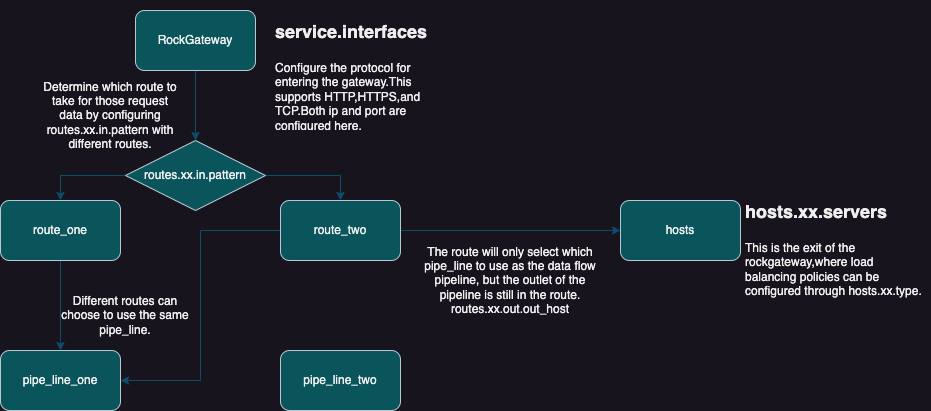
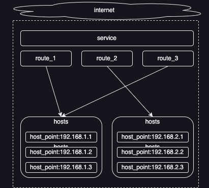

# **RockWaypoint-RWP**

## **Introduction**
RockWaypoint is a high-performance and absolutely open asynchronous gateway.
It can be used as a top-level gateway or an API gateway.
Supports multiple protocols: TCP, HTTP, and HTTPS.
Supports multiple plug-ins, plug-and-play configuration, and the plug-ins can be combined freely and configured randomly.
（Ratelimiter, Circuit breaking, Black and white lists...Caching, etc.）
And a variety of load balancing strategies have been added for the host address.
Support multiple configuration file formats: [yaml](rock.yaml), [ron](rock.ron), [toml](rock.toml), [json](rock.json).(These four configuration methods express the same meaning.)

**In RockWaypoint, there are the concepts of route and pipe_line. Multiple routes can be created in RockWaypoint. Multiple pipe_lines can also be created. There is a many-to-one relationship between route and pipe_line**
****

- **The entry configuration of RockWaypoint is in service.interfaces, and here it supports multiple protocols such as http, https, and tcp.**
- **After the data enters into RockWaypoint, which route to take is configured in route.xx.in.pattern. Through regular expressions, matching the entered path determines which route configuration the current request takes.**
- **The configuration of the route not only determines the entry of the request, but also determines where the exit of the request data is. It also determines which pipe_line is used as the pipeline for the request data from the entry to the exit.**
- **Different routes can choose the same pipe_line as the data flow pipeline.**
- **The route will only choose which pipe_line as the pipeline of the data flow, but the exit of the data flow is still configured in the route.**

### **route/pipe**

If two different routes use the same pipe. Then the system will automatically generate two different pipe instances for the two routes.

## **hosts**

**Network host host_point configuration**

Here, load balancing, error_handling_plan, the weight of host_point, etc. can be selected for some specific configurations of host_points. the host_name here can be named casually and the current configuration will be selected in the configuration of pipe_line.

```bash
hosts:
  httpbin: # host-name Name casually
    type: round_robin  # least_connection  random  ip_round_robin
    error: test1
    servers:
      - 192.168.1.1:80 timeout=5000ms weight=3 max_fails=3 fail_timeout=9s
  httpsbin:
    type: round_robin
    servers:
      - www.baidu.com:443
  tcpbin:
    type: ip_round_robin  # least_connection  random  round_robin
    servers:
      - 192.168.1.2:80 
```

### **Load balancing**

**There are many load balancing methods for the forwarded target hosts set here, such as round_robin, random, and ip_round_robin.**

- round_robin: It will poll to each target host in turn according to each request. It is suitable for http and https protocols.
- random: It will randomly go to different target hosts according to each request. It is suitable for http and https protocols.
- ip_round_robin: It will poll to each target host in turn according to the IP address of the request. It is suitable for http, https, and tcp protocols.

### **Weight**

**weight**

Configured behind each host_point and separated from other configurations by a space. If the weight is not configured, it defaults to 1.

### **error_handling_plan**

Here, you can choose the error_handling_plan, just fill in the name of the error_handling_plan, and for the specific configuration of the error_handling_plan, see [errors](#errors).

### **Circuit Breaking**

Detailed content can be clicked [Circuit Breaker Configuration](#circuit-breaker)

## **routes**

**All route configurations of the gateway are set here**

```yaml
routes:
  http_test:		# route name
    protocol: http # http,https,tcp 
    priority: 999
    ratelimiter:
      type: route # route,ip
      period: 1s
      burst: 2
    in:
      type: regex
      pattern: "^/w*"
      method: ["GET", "POST"]
    out:
      type: network
      path: "/"
      out_host: httpbin
    pipe: http_pipe
```

### **priority**

**The priority of the route**

If there are too many routes set, which one to try to match first can be set with priority. If this value is not set, then the current route priority is 1. The larger this setting value, the higher the priority.

### ratelimiter

**Route-level current limiting setting**

Here it is divided into two modes: route and ip. During the entire operation of the gateway, different routes have their own instances, and the data is isolated from each other.
There are two settings for type:

- route: Only burst requests are allowed to pass through the current route within the period time. 
- ip: Different remote_ip at the current route level is only allowed to have burst requests pass through within the period time.

```bash
  ratelimiter:
    type: service # route,ip
    period: 1s    # Within what period of time
    burst: 100    # Allow how many requests to pass through
```

### in

**Route entry configuration**

The entry is divided into three configurations: regex, ip, and ipfile.
The method is an optional item and only takes effect when it is the http or https protocol.

- regex: Used to match the route according to the http request url path, Supported protocols: http, https.

  ```yaml
  type: regex
  pattern: "^/w*"  # Ragular expression
  method: ["GET", "POST"] # Optional item, only takes effect  is http and https protocols.
  ```

- ip: Used to match the route according to the Ip range. Supported protocols: http, https, tcp.

  ```yaml
  type: ip
  ranges: 
  	- "127.0.0.1-127.0.0.1"
  	- "192.168.1.0-192.168.1.255"
  method: ["GET", "POST"] # Optional item, only takes effect is http and https protocols.
  ```

- ipfile: It is used to match the route according the the IP range in the file. Supported protocols: http, https, tcp.

  ```yaml
  type: ipfile
  file: "ip.txt"  # file
  method: ["GET", "POST"] # Optional item, only takes effect is http and https protocols.
  ```

### out

**used to configure the exit of the gateway**

There are mainly two configurations, one is to forward to the network host, and the other is to forward to the local file system.

host:

```yaml
type: network
path: "/" # It will be attached between the IP address of the host_point and the request path. "/" represents not appending any path. This option only takes effect in http and https protocols. 
out_host: httpbin # host_name
```

file:
````yaml
type: file
root_path: examples/web_s # web root path
index_file: index.html    # web index file name
````

### pipe

**Choose which pipe_line to use**

Just fill in the pipe_name

## errors<a id="errors"></a>

**Used to configure the error_handling_plan. That is, the exception handling measure from a business perspective.**

```yaml
errors:
  test1: 
    type: http
    error_list: hsc_404 hsc_500 hsc_504
    pass_next: true
    return: hsc_404
```

- errors: Below, many error_handling_plan can be written. Just give it any name.
- type: Currently only supports the http, https protocol. 
- error_list: Separated by spaces, starting with `hsc_`. It is mainly used to indicate which StatusCode in the http_response will be regarded as an error.
- pass_next: After the current http_response is regarded as an error, whether to pass the request to the next host_point. Here, a new host_point will be reloaded and balanced.
- return: When there is no host_point available, or in the case that pass_next is false, when the current http_response is regarded as an error, at this time, which StatusCode needs to be returned to the requester of the gateway. Use `hsc_` at the beginning.

## pipes

**pipe_line settings**

We call pipes pipe_line in the document, but actually it is called pipes in the configuration file. All the plug-ins are configured inside pipes, and in rockwaypoint, the plug-in is called pipe_module.

```rust
pipes:              # Each pipeline has its own independent memory_cache instance.
  http_pipe:
    - ratelimiter:
        type: service # service,route,pipeline,ip_pipe,ip_route,ip_service
        period: 1s
        burst: 2
    - memory_cache_get:
        hit: 3      # When the number of hits reaches or exceeds this number, the cache will be automatically deleted.
        expire: 3min  # After a cache hit, the cache expiration time is reset.
    - header_request:
        add:
          - Rock-Jiang: 'rockjiang'
        del:
          - "abc"
          - "hohoho"
    - dispatche:
    - header_response:
        add:
          - Access-Control-Allow-Origin: '*'
          - Access-Control-Allow-Headers: 'origin, content-type, accept'
          - Access-Control-Allow-Methods: 'GET, POST, PUT, DELETE'
    - memory_cache_set: 
        hit: 0      # Initial hit count.
        expire: 3min # First timeout time.
                    # (year - y,month - m,week - w,day - d,hour - h,minute - min,second - s,millisecond - ms,microsecond - us,nanosecond - ns,picosecond - ps) 
                    # Calculate weekly based on 7 days.
                    # Calculate monthly based on 30 days.
                    # Calculate annually based on 365 days.
                    # ps is allowed to be set, but unless it is greater than 1000, it will be calculated as 0 ns. The excess will also be rounded off. The minimum unit of the gateway is ns.
    - return:
  tcp_pipe:
    - dispatche:
```

Interpret the above pipe_line configuration:

> 1. First of all, here a name is given to the pipe_line called http_pipe.
> 2. The execution order of the above pipe_modules is like this:
>    ratelimiter
>    memory_cache_get
>    header_request
>    dispatche
>    header_response
>    memory_cache_set
>    return
> 3. If the rate-limiting threshold of the ratelimiter is reached. Then directly return according to the current rule.Otherwise, continue to execute downward.
> 4. If there is a hit in the cache value memory_cache_get, then the subsequent pipe_modules will not enter and directly execute the return of this pipe_module normally. If not, then continue to execute downward.
> 5. The pipe_module of header_request is used to modify the header data in the request before the request. If the same key exists, it will be overwritten, and if the different key exists, it will be added. It is also possible to delete key.
> 6. The role of the pipe_module dispatch is to forward the request data to the address specified by "hosts".
> 7. The role of the pipe_module "header_response" is similar to that of "header_request"."header_response" modifies the header of the returned request and does not modify the header of the request.
> 8. Here, "return" is also a pipe_module. Its role is to organize the already formed return data to form a returnable response. This return data may be obtained from "hosts" through "dispatche", or it may be obtained from the "cache". It doesn't matter. But the purpose of "return" is only one, that is, to organize the data, a data that can be directly returned.

## pipe_module

### upgrade_insecure_requests

**HTTP upgrading to HTTPS**

A special pipe_module.
Supported protocol: http.
When the gateway sets the global configuration disable_upgrade_insecure_requests as false, it will be executed when the http protocol data enters.

### cache

**Cache settings**

#### memory_cache_set

Local cache pipe_module. Used for storing cache. It contains two parameters, hit and expire.
Supported protocol: http, https
hit:
	Initialize the hit count. If it is not set or set to -1, then the hit count is not enabled.
	This is just an initial value. However, if the hit value is not set in memory_cache_get, then it will not be judged every time it is retrieved from the cache.
expire: 
	Initialize the expiration time of the key. If it is not set, it defaults to permanent and does not expire.

#### memory_cache_get
Local cache pipe_module. It is used to obtain the cache. It contains two parameters, hit and expire.
Supported protocol: http, https
hit:
    The maximum number of cache hits. If it is not set or set to -1, then the calculation of cache hit count will not be performed.
    If the initial value is not set in memory_cache_set.hit, then the initial value will be set to 1 here. It represents that it has been hit once.
expire:
    After a cache hit, the expiration time of the refreshed cache. If it is not set or set to 0, then use the old cache expiration time (that is, the cache expiration time set when memory_cache_set.expire. If it is not set, there is none). If it is set, then refresh the cache expiration time according to this value.
back:
    Whether to return immediately after a cache hit. Default is false.

#### redis_cache_set
Redis cache pipe_module. It is used for storing cache. It contains two parameters, hit and expire.
Supported protocol: http, https
hit: 
    Initialize the hit count. If it is not set or set to -1, then the hit count is not enabled. When initializing, the hit data will not be stored in the cache.
    This is just an initial value. However, if the hit value is not set in redis_cache_get, then it will not be judged every time it is retrieved from the cache.
expire: 
    Initialize the expiration time of the key. If it is not set, it defaults to permanent and does not expire.

#### redis_cache_get
Redis cache pipe_module. It is used by users to obtain the cache. It contains two parameters, hit and expire.
Supported protocol: http, https
hit:
    The maximum number of cache hits. If it is not set or set to -1, then the calculation of cache hit count will not be performed.
    If the initial value is not set in memory_cache_set.hit, then the initial value will be set to 1 here. It represents that it has been hit once.
expire:
    After a cache hit, the expiration time of the refreshed cache. If it is not set or set to 0, then use the old cache expiration time (that is, the cache expiration time set when memory_cache_set.expire. If it is not set, there is none). If it is set, then refresh the cache expiration time according to this value.
back:
    Whether to return immediately after a cache hit. Default is false.

### header_request

**header_request modifier**

Supported protocol: http,  https

- add:  is a key-value pair. Actually, it is the addition of the header.
- del:  is just ad string, and it is only necessary to fill in the key of the header. it is deleted through the key.

The "add" value here is an "append" operation. If there is the same key, or there is already the same key in the headers, the "append" operation will be performed instead of the "add" operation. So when there is the same key, the value of the later key will not overwrite the value of the previous key. Therefore, if you don't want the original one, you need to add the corresponding key in the "del". Because the "header_response" will execute "del" first and then execute "add".

```yaml
header_request:
	add:
		- RWP: 'rockwaypoint'
	del:
		- "abc"
 		- "hohoho"
```


### header_response

**header_response modifier**

Supported protocol: http,  https

- add:  is a key-value pair. Actually, it is the addition of the header.
- del:  is just ad string, and it is only necessary to fill in the key of the header. it is deleted through the key.

The "add" value here is an "append" operation. If there is the same key, or there is already the same key in the headers, the "append" operation will be performed instead of the "add" operation. So when there is the same key, the value of the later key will not overwrite the value of the previous key. Therefore, if you don't want the original one, you need to add the corresponding key in the "del". Because the "header_response" will execute "del" first and then execute "add".

```yaml
add:
	- Connection: keep-alive
	- Access-Control-Allow-Origin: '*'
	- Access-Control-Allow-Headers: 'origin, content-type, accept'
	- Access-Control-Allow-Methods: 'GET, POST, PUT, DELETE'
```


### dispatche

**network or file redirect**

The pipe_module that actually executes the forwarding. Here, the destination specified in route.xx.out will be executed.
Supported protocol: http, https, tcp

#### dispatch_network

This pipe_module belongs to the sub-pipe_module of dispatche. It cannot be directly configured in the pipe_line. It is automatically selected and executed inside dispatch. 
<font color=red>Note: If during the execution process of the current pipe_line, the cache has already been hit. Then the current pipe_module will not be executed.</font>

#### dispatch_file

This pipe_module belongs to the sub-pipe_module of dispatche. It cannot be directly configured in the pipe_line. It is automatically selected and executed inside dispatch. 
<font color=red>Note: If during the execution process of the current pipe_line, the cache has already been hit. Then the current pipe_module will not be executed.</font>

#### dispatch_tcp

This pipe_module belongs to the sub-pipe_module of dispatche. It cannot be directly configured in the pipe_line. It is automatically selected and executed inside dispatch. 
<font color=red>Note: If during the execution process of the current pipe_line, the cache has already been hit. Then the current pipe_module will not be executed.</font>

### black_white_list

**Black and white list**

Supported protocol: http, https, tcp

> Configurations rules:
>
> 1. Give priority to matching memory. If memory exists, the file configuration will not be considered. If both are configured, the file configuration will be ignored.
> 2. Give priority to inspecting the white_list first, and then inspect the black_list.
> 3. If the white_list is configured, the data of the current pipe_line passes and must strictly follow the white_list. If the IP is not in the white_list, it cannot pass.
> 4. If the black_list is configured and the IP is within the black_list, it cannot pass.
> 5. The black and white list can configure a single IP or an IP range.
> 6. Configuring 0.0.0.0 or configuring 0.0.0.0 - 0.0.0.0 represents matching all IP address.
> 7. If 0.0.0.0 is configured in the white_list, it represents that all IP addresses can pass.
> 8. If 0.0.0.0 is configured in the black_list, it means that any and all IPs cannot pass.

```rust
pipes:              
  xxx:
    - black_white_list: # black and white list pipe_module
        black_list: 	  # start the blacklist
          memory:				# blacklist memory setting
            - "127.0.0.1-127.0.0.255"
          file: examples/test.txt  # blacklist file setting
        white_list: 	  # start the whitelist
          memory: 			# whitelist memory setting
            - "127.0.0.1-127.0.0.255"
            - "192.168.1.1-192.168.1.255"
          file: examples/test.txt	# whitelist file setting
```


### ratelimiter

**rate-limiting**

Supported protocol: http, https

The ratelimiter is based at the bottom on the governor crate.
The rate-limiting is divided into the difference between gateway-level rate-limiting and route-level rate-limiting.
The ratelimiter is a pipe_module. However, the setting of rate-limiting is not inside pipes.xx..
If the route-level rate-limiting configuration is selected, the current pipe_line will enable which rate-limiting configuration according to which route has selected itself.

<font color=red>So if you want a ratelimiter to take effect, at least two places need to be set</font>
<font color=red>service+pipe_line or routes+pipe_line</font>

#### The rate-limiting at the gateway level needs to be set within the service
> Here divided into two kinds: service and ip.
> - service: It indicates the current gateway-level rate-limiting setting, and there is only one key.
> - Ip: It indicates the current gateway-level rate-limiting setting, and uses ip as the key.
> 
> period: within what period of time
> burst: how many request data are allowed to pass
```yaml
service:
  ratelimiter:
    type: service # service,ip
    period: 1s
    burst: 2
```
#### The rate-limiting at the route level needs to be set within the routes
> Here divided into two kinds: route and IP. Different routes can set their own different rate-limiting schemes.
>
> - route: It indicates the current route-level rate-limiting setting. The rate-limiting data of different routes are isolated from each other, and different routes use the same key for themselves.
> - ip: It indicates the current route-level rate-limiting setting. The rate-limiting data of different routes are isolated from each other, and use ip as the key.
>
> period: within what period of time
> burst: how many request data are allowed to pass
```yaml
routes:
  xxx:
    ratelimiter:
      type: route # route,ip
      period: 1s
      burst: 2
```
#### pipes: The pipes setting for rate-limiting

However, if the rate-limiting setting is only set on the service and routes. In fact, the rate-limiting pipe_module has not been started yet. 
ratelimiter is a pipe_module. To instantiate this pipeline model, we also need to set the corresponding ratelimiter in the pipeline.

> Here there is only one attribute of "type", and "type" can only be selected as "service" or "route"
> Here are two meanings.
>
> 1. Enabled the ratelimiter this pipe_module.
> 2. Selected which level of rate-limiting to use. Service or route.
>
> Here it may feel rather complicated. Due to the data structure design of RockWaypoint, gateway->routes->pipes.Under the gateway, multiple routes can be set, and the routes can choose different pipes or also choose the same pipe as the pipeline for the data flow.
> The actual data execution is within the pipeline. For example:
>
> 1. If the route has set its own data rate-limiting setting. But the type of the pipe currently selected by the route has chosen "service". At this time, the data rate-limiting setting set by the current route is in an ineffective state and will not play any role.
> 2. If neither the service nor the route has set the data rate-limiting setting, but the rate-limiting is enabled in the ratelimiter of the pipe_module.At this time, the gateway cannot find the rate-limiting data in the service or the route, and starting will report an error.
> 3. If there are two routes that have both set their own different data rate-limiting settings, but the two routes point to the same pipe_line, and the pipe_line has enabled the route-level rate-limiting. Since the pipe_line will generate data-independent pipe_lines for different routes when the gateway start.So the gateway will generate different pipe_lines and internal different ratelimiter pipe_modules for the two routes respectively, and enable the data rate-limiting settings of the different routes themselves.
>
```yaml
pipes:              # Each pipeline has its own memory_cache.
  xxx:
    - ratelimiter:
        type: service # service,route
```
<font color=red>So correctly configuring one's own options and carefully checking the configuration items can makethe gateway execute better.</font>
    
Note: After being intercepted by the ratelimiter currently, it will directly return 404.
         The ratelimiter currently only supports the http protocol.

### return

**Data return**

This is a special pipe_module. It will organize all the data that has already been obtained from the network or file and generate the final return data.
This pipe_module will only organize and summarize the data and will not modify and data. In the entire execution process of the pipe_line, before each execution of the pipe_module, it will be checked whether the final return data has been generated. If so, any subsequent pipe_module will no longer be executed.
Supported protocols: http, https

## Circuit breaker<a id="circuit-breaker"></a>

The circuit breaker configuration of the gateway includes two points.

- The configuration for the host_point. The configuration here indicates how to deal with this host_point when certain exceptions occur on the host_point.
- The setting of the error handling plan for the two levels of route or hosts. Here it is set how to deal with this error when hosts have an error. Return directly or redirect the request to the next server. We call it error_handling_plan here, and it is actually configured separately in the errors in the configuration file.

### host_point circuit breaker configuration

The circuit breaker configurations of the host_point needs to be configured within the hosts.

```yaml
hosts:
  httpbin: # host-name
    type: round_robin  # least_connection  random  ip_round_robin
    servers:
      - 192.168.1.10:80 timeout=5000ms weight=3 max_fails=3 fail_timeout=9s
```

- timeout: Here timeout can be set for each server, and there is no unified setting method. If timeout is not set, the default timeout is 20 seconds.
- weight: default is 1.
- max_fails_durn: Indicates within what period of time, when the value of max_fails is reached, the fail_out_event will be executed. The default value is 60 minutes.
- max_fails: It represents the maximum number of times an error occurs. After reaching this number within the max_fails_durn time, the fail_out_event needs to be executed. <font color=red>Note: This is a cumulative value within a max_fails_durn time. The errors here will only be for all network errors that occur when sending a request to the host_point, including timeout. The error list specified by the error_handling_plan will not be cumulative here. However, if this value is not set, any network error encountered by the host_point, including timeout, will not be handled in any way.</font>
- fail_timeout: When the number of errors reaches max_fails, the current host_point will be suspended from use until after the time specified by fail_timeout, and then it will be added to the alternative list. After being added to the alternative list, the value of max_fails is cleared. <font color=red>Note: If this value is not specified, when the number of errors reaches max_fails, the host_point will be suspended from use permanently.</font>

Explanation: fail_out_event: A error handling procedure specifically for the host_point.

### error_handling_plan

error_handling_plan: Here it is set how to be recognized as an error and what kind of content to return after encountering an error.
The setting of the error_handling_plan can be set at two levels. The two levels of route and hosts. These two levels will overwrite upward.

If the error_handling_plan is specified at the hosts level, then regardless of whether it is set at the route level or not, it will be executed according to the setting at the hosts level.

```yaml
errors:
  test1: 
    type: http
    error_list: hsc_404 hsc_500 hsc_504
    pass_next: true
    return: hsc_404
```

If any route does not have an error handling process set, the gateway will generate a default error_handling_plan for it.
```yaml
error_list: 
pass_next: true
return: origin
```

#### type

Only supported http.

#### error_list

Set the error list here, indicating which return contents will be recognized as errors. Separated by spaces.
```yaml
hsc_xxx:  # In the http_header returned by the server, it includes the http status code.
```

<font color=red>Note: If any exception occurs during the gateway's initiation of a request or during the transmission process, including timeout. It will be automatically recognized as an error.</font>

#### pass_next

This option indicates whether to attempt to send the request to the next host_point when the identified error occurs. The default is false.

<font color=red>Note: When this option is set to false, or when there is no host_point available in the current hosts, the content set in'return' will be returned.</font>

#### return

Set the return content here, indicating what will be returned when the identified error occurs. If not set, the default option of origin will be executed.
```yaml
origin:   # It means that whatever error occurs on the server will be returned -- this is also the default option.
hsc_xxx:  # which kind of http status code content to return.
```

### Circuit breaker configuration-generated understanding errors.



The host_point circuit breaker configuration and the error_handling_plan belong to two dimensions of settings.

The host_point circuit breaker configuration can be understood as an abnormal handling configuration from a technical perspective, which is a simple abnormal handling for the abnormalities of the host_point.

The error_handling_plan can be understood as an abnormal handling configuration from a business perspective. The pass_next of the error_handling_plan will not wait until the max_fails of the host_point circuit breaker configuration is reached before going to the next server, but will immediately reload_balance a new host_point. This new host_point may also be the same as the previous one, which depends on the weight configuration of the host_point. The max_fails of the host_point is a cumulative value, rather than triggering the fail_out_event event only when reaching the max_fails in a single request.

## Global configuration
### service gateway global configuration
#### disable_upgrade_insecure_requests
**Whether to disable handling upgrade_insecure_request in http requests. If not configured, it is disabled by default.**

when the gateway acts as the top-level web service gateway, it is recommended to set this configuration item to false. At this time, it can automatically switch from http to https.

However, if it acts as an api gateway, it is recommended to set this configuration item to true.

#### external_ip

**External network IP address**

When this configurations is set and the disable_upgrade_insecure_requests option is set to false, the gateway will automatically upgrade the http protocol to the https protocol. At this time, an http_response with a 302 status code needs to be returned to set the location of the 302 http_response.

If this value is not set, the upgrade_insecure_requests pipe_module will not work.

#### ratelimiter

**Gateway-level rate-limiting settings**

Here it is divided into two modes: service and ip. During the entire operation of the gateway, there is only this one gateway instance.
There are two types of settings:

- service: The current gateway only allows burst requests to pass within the period time.
- ip: Different remote_ip at the current gateway level only allows burst requests to pass within the period time.

```bash
  ratelimiter:
    type: service # service,ip
    period: 1s    # within what period of time
    burst: 100    # allow how many requests to pass through
```

#### interfaces

**the port address listened to by the gateway**

Here it supports http, https and tcp. At present, the http and https protocol functions of the gateway are the most functionally complete.

For each protocol, list configuration is supported, and multiple incoming ports can be listened to.

```bash
  interfaces:
    http:
      - address: "0.0.0.0:8180"
    https:
      - address: "0.0.0.0:8181"
        ssl_cert: ca/cert.pem 
        ssl_key: ca/server.key.pem 
    tcp:
      - address: "0.0.0.0:8182"
```

#### multi_thread/current_thread

**tokio configuration**

Contains a lot of internal configurations of tokio.

```bash
    event_interval: 61              # This helps in configuring the frequency of event handling within the runtime, allowing for fine-tuning of the runtime's behavior based on specific application requirements. It affects how often the runtime checks for new events, tasks to execute, and other asynchronous operations.
    thread_name: gateway_thread_    # The thread name of the thread started when the tokio runtime is launched.
    # thread_stack_size: 819200         # The thread stask size of the tokio runtime.
    global_queue_interval: 128     # It is used to specify the time interval at which the Tokio runtime checks the global task queue to obtain new tasks for execution. By adjusting this interval, it can have a certain impact on the frequency and performance of task scheduling.
    max_blocking_threads: 512       # The default is 512, which is the maximum number of threads that can be schedulable. The actual maximum number of threads that can be blocked is max_blocking_threads + core_threads.
    nevents: 1024                   # It is used to set the maximum number of I/O events that can be processed per tick. This helps to control the rate at which I/O events are handled within the Tokio runtime, and will have an impact on the efficiency and performance when dealing with a large number of concurrent I/O operations. It allows for fine-tuning of the balance between handling a large amount of I/O events and avoiding overburdening the system by processing too many events at once.
    core_threads: 8                 # The number of tokio working threads. If not specified, it will be the number of CPU cores of the current system.
    bind_cpu: all                   # Whether it is necessary bo bind to the CPU for work.
```

bind_cpu: There are five kinds of configurations

- all : bind all cpu
- half : bind to half of the current system's CPUs
- even : bind to the even-numbered CPUs
- odd : bind to the odd-numbered CPUs
- xxx : Wrting a direct number indicates how many CPUs to bind for execution, and here it starts binding from the CPU with index 0. Note: If the quantity exceeds the number of CPU cores in the current system, the gateway will report an error when executing.

#### cache

Global cache configuration

When the pipe_line is in the process of execution, if any of the pipe_modules such as memory_cache_set, memory_cache_get, redis_cache_set, or redis_cache_get is used, the global configuration here will be automatically used. If the global configuration here is not configured, a memory configuration will be defaulted, and the default interval for cleaning the cache is 60 minutes.
```bash
    memory: # memory
      clear_time_interval: 60min # The interval time for cache cleaning.
    redis: # redis
      ip: 192.168.1.13
      port: 6379
      pwd: 123456
```


